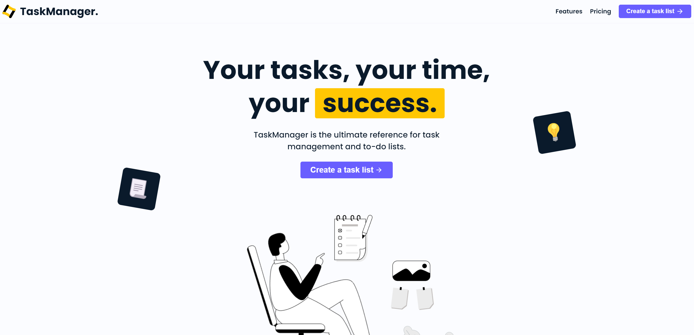
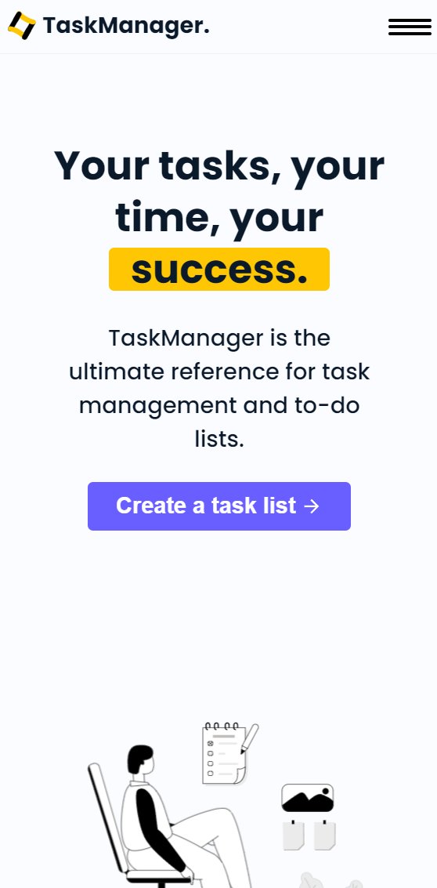
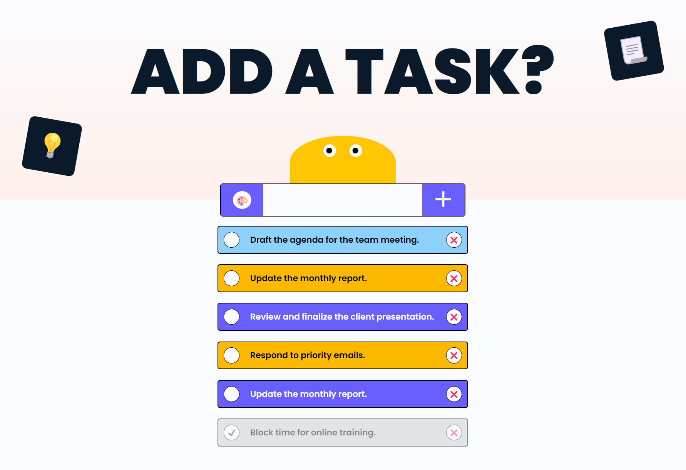
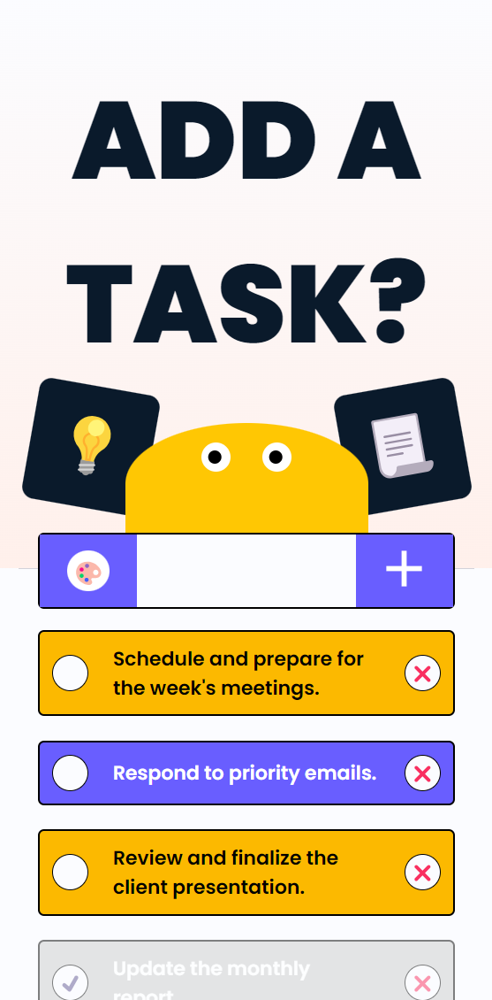
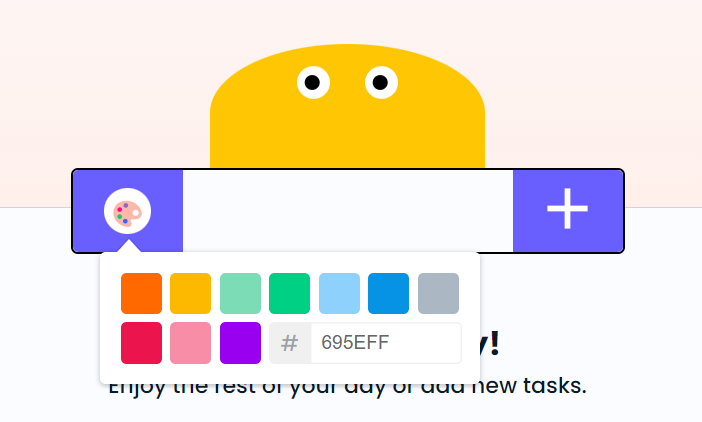

# Todo List sous React

## Captures d'écran

### Landing Page (Version Desktop)


### Landing Page (Version Mobile)


### Dashboard (Version Desktop)


### Dashboard (Version Mobile)


### Choix des Couleurs des Tâches


## Technologies utilisées
- ViteJS
- TypeScript
- React
- React Router DOM
- GSAP (pour les animations)
- SCSS et BEM (pour une gestion efficace des styles)

## Prérequis
Assurez-vous d'avoir Node.js et npm installés.

## Installation
1. Clonez ce dépôt : `git clone https://github.com/votre-utilisateur/todo-list-react.git`
2. Installez les dépendances : `npm install`

## Exécution du projet
Pour lancer l'application en mode développement, utilisez la commande :
```bash
npm run dev
```

## Fonctionnalités
- Design moderne et actuel pour la landing page et l'application.
- Ajout d'animations GSAP pour la landing page, pour une expérience utilisateur dynamique et engageante.
- Gestion de la navigation grâce à React Router DOM.
- Création, lecture, mise à jour et suppression de tâches.
- Ajout de couleurs pour personaliser les taches.

## Axe d'amélioration
- Ajouter des variables SCSS pour améliorer la gestion des styles.
- Implémenter des fonctionnalités de "drag and drop" pour faciliter le tri des todos.
- Ajouter la posibilité de modifier le nom et la couleur des tâches.
- Réaliser des tests unitaires.

## Responsive Design
Le site est entièrement responsive.

## Remarques supplémentaires
J'ai pris énormément de plaisir à réaliser ce projet. J'ai eu de nombreuses idées que j'ai pu mettre en œuvre. J'espère que ce projet démontre mon engagement envers l'intégration et le design sous React.
